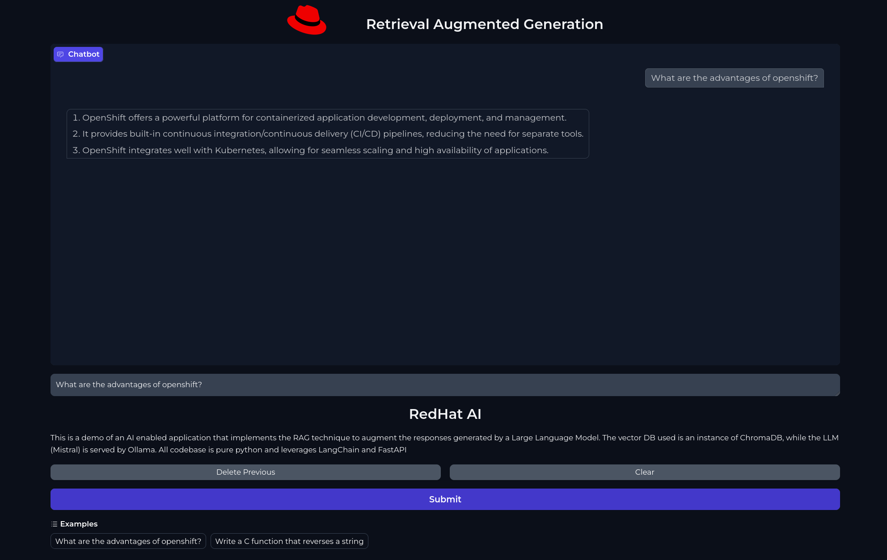

# Retrieval Augmented Web Frontend

This is a RAG Web Application written using Gradio and FastAPI.
It exposes a way to chat with an LLM while augmenting the response with precise data fetched from a Vector DB.

Technologies used:

- ChromaDB as the Vector Store
- Langchain with Integrations
- Ollama
- Mistral LLM
- Gradio
- Python 3.12



## Run Locally

The application runs locally by launching it via the `fastapi` cli command:

```bash
# development mode
$ fastapi dev

# production mode
$ fastapi run
```

